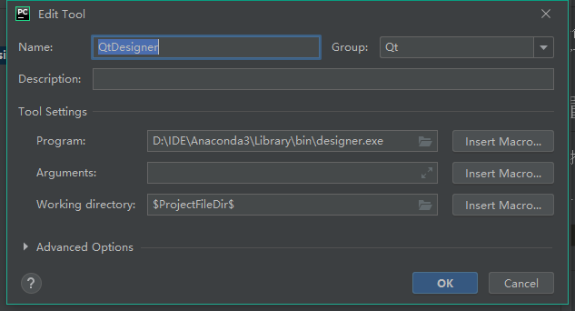
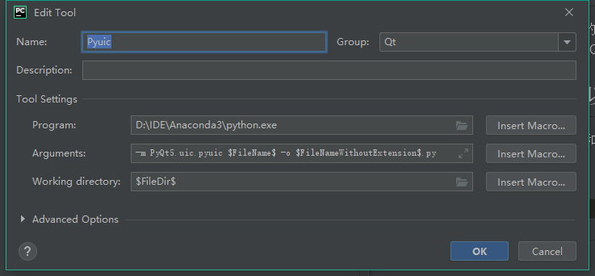

# 基础知识

## 1 什么是Qt
Qt是使用C++语言编写的跨平台GUI库。用于Qt是使用C++语言编写，因此Qt开发的GUI程序的界面风格与当前的操作系统相同。

## 2 什么是PyQt
PyQt是一个用于创建GUI程序的跨平台工具包。PyQt允许使用Python调用Qt库中的API。PyQt对Qt做了完整的封装。
截至写下此笔记，PyQt的最新版本为5.14.2。

## 3 环境配置（IDE以Pycharm为例）
主要工作在于配指QtDesinger和Pyuic工具
设置步骤为：
File -> Settings -> Tools -> External Tools
按照下图设置即可

